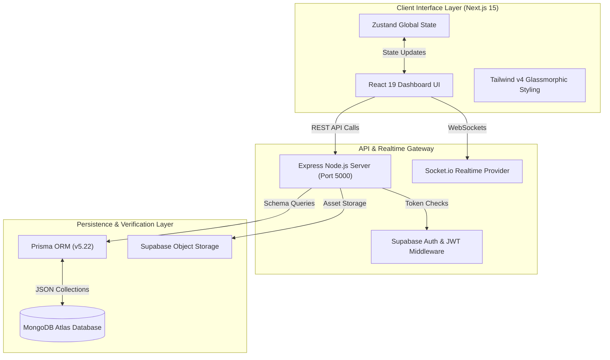

# ⚡ AETHERIS — AI-Native Employee Verification Ecosystem

<div align="center">


[](https://github.com/pranavmaheshwari86-cpu/EMPLOYEE-VERIFICATION-PORTAL)
[](https://github.com/pranavmaheshwari86-cpu/EMPLOYEE-VERIFICATION-PORTAL)
[](LICENSE)
[](CONTRIBUTING.md)
[](https://nextjs.org)
[](https://www.typescriptlang.org)
[](https://github.com/pranavmaheshwari86-cpu/EMPLOYEE-VERIFICATION-PORTAL)

**Hire through proof, not promises. The world's first AI-native employee verification platform.**

*Finally, a way to verify candidate technical depth, work history, and project capability instantly without manual background checks or fraudulent resumes.*

[Explore App](http://localhost:3000) • [API Reference](#-quick-start-60-second-setup) • [Documentation](memory/how-to-run.md) • [Report Issue](https://github.com/pranavmaheshwari86-cpu/EMPLOYEE-VERIFICATION-PORTAL/issues)

</div>

---

## 🚀 OVERVIEW

Traditional background checks and employee verification workflows are fundamentally broken. Organizations waste billions of dollars and weeks of recruiter time processing slow, manual employment verification checks while dealing with widespread resume inflation, fake work histories, and unverified skill claims.

**AETHERIS** redefines hiring for the AI era. It is an end-to-end employee verification ecosystem that pairs cryptographically-backed career records with AI technical capability analysis. With AETHERIS, candidates own an immutable, verifiable record of their technical contributions, while recruiters gain instant 1-click verification, real-time candidate-to-job matching, and tamper-proof employment validation.

---

## 🌟 KEY FEATURES

* 🛡️ **Cryptographic Proof-of-Work Verification**: Issues immutable, cryptographically verifiable employment credentials that eliminate fake resume claims and manual background verification calls.
* 🤖 **AI-Native Skill & Job Matching Engine**: Analyzes candidate repositories, verified work experiences, and tech stacks to compute precision compatibility scores for recruiters in real-time.
* ⚡ **Glassmorphism Executive Interface**: High-polish, responsive dark-mode dashboard built with React 19, Tailwind CSS v4, and hardware-accelerated Framer Motion animations.
* 🔄 **Real-Time Automated Verification Workflows**: Real-time Socket.io communication channel connecting employers, employees, and background verification agents instantly.
* 🔒 **Enterprise Role-Based Access Controls (RBAC)**: Segregated dashboards tailored specifically for Employees, Recruiters, and Platform Administrators with granular privacy controls.

---

## 🏗️ SYSTEM ARCHITECTURE



---

## 🛠️ TECH STACK & DESIGN CHOICES

| Technology | Role | Why It Was Chosen |
|---|---|---|
| **Next.js 15 (App Router)** | Frontend Framework | Fast server-side rendering, instant page transitions, and Turbopack bundler acceleration. |
| **React 19** | UI Engine | Modern concurrent rendering, clean hook architectures, and high-performance DOM updates. |
| **TypeScript 5.9** | Code Quality | Full end-to-end type safety, eliminating runtime null/undefined crashes across API boundaries. |
| **Tailwind CSS v4** | Styling Framework | High-speed CSS engine with custom `@theme` variables for premium glassmorphism visuals. |
| **Express & Node.js** | Backend API | Lightweight, asynchronous REST API gateway designed for low-latency request processing. |
| **Prisma ORM & MongoDB** | Data Layer | Type-safe database queries paired with flexible document schema storage on MongoDB Atlas. |
| **Supabase** | Authentication & Storage | Enterprise-grade JWT token management, OAuth provider integrations, and encrypted document storage. |
| **Zustand** | State Management | Zero-boilerplate global state container replacing complex Redux architectures. |

---

## ⚡ QUICK START (60-SECOND SETUP)

### Prerequisites
* Node.js v18.0.0 or higher
* npm v9.0.0 or higher
* Docker & Docker Compose *(optional)*

### 1. Clone & Install Dependencies
```bash
# Clone the repository
git clone https://github.com/pranavmaheshwari86-cpu/EMPLOYEE-VERIFICATION-PORTAL.git
cd EMPLOYEE-VERIFICATION-PORTAL

# Install Frontend dependencies
npm install

# Install Backend dependencies
cd backend && npm install && cd ..
```

### 2. Environment Configuration
Copy environment templates for both frontend and backend:
```bash
# Setup root environment file
cp .env.example .env

# Setup backend environment file
cp .env.example backend/.env
```

### 3. Generate Prisma Database Schema
```bash
cd backend
npx prisma generate
cd ..
```

### 4. Run Development Servers
```bash
# Terminal 1: Start Backend API (Port 5000)
cd backend && npm run dev

# Terminal 2: Start Frontend Application (Port 3000)
npm run dev
```

Visit `http://localhost:3000` to launch AETHERIS!

<details>
<summary>🐳 <b>Run with Docker Compose (Single Command)</b></summary>

```bash
docker-compose up --build
```
Access the application at `http://localhost:3000`.
</details>

---

## 📖 USAGE / DEEP DIVE

### 1. Requesting Career Verification
Candidates can submit verified work experiences and project references through the employee dashboard.

```typescript
import { fetchAPI } from "@/lib/api";

// Submit verification request
const requestVerification = async (employeeId: string, type: "EMPLOYMENT" | "SKILL") => {
  const response = await fetchAPI("/employee/verification", {
    method: "POST",
    body: JSON.stringify({
      employeeId,
      type,
      status: "PENDING",
      timestamp: new Date().toISOString()
    })
  });
  return response;
};
```

### 2. Verification API Health Check
```json
// GET http://localhost:5000/health
{
  "status": "ok",
  "service": "aetheris-api",
  "timestamp": "2026-08-16T14:24:00.000Z"
}
```

---

## 📂 PROJECT STRUCTURE

```
EX-EMPLOYEE-VERIFICATION-PORTAL/
├── backend/                  # Express REST API & Prisma Service
│   ├── prisma/               # Database Schema & Migrations
│   │   └── schema.prisma     # MongoDB Schema Models
│   ├── src/
│   │   ├── controllers/      # Employee, Recruiter & Auth Controllers
│   │   ├── middleware/       # JWT Auth & Rate Limiting Middleware
│   │   ├── routes/           # REST API Endpoint Declarations
│   │   ├── services/         # Verification Logic & External Sync
│   │   └── server.ts         # Main HTTP & Express Entry Point
│   └── package.json
├── src/                      # Next.js 15 Frontend Core
│   ├── app/                  # Next.js App Router Pages
│   │   ├── auth/             # Login, Register & Company Onboarding
│   │   ├── dashboard/        # Role-Based Employee/Recruiter/Admin Dashboards
│   │   ├── jobs/             # Public & Matched Job Board
│   │   └── layout.tsx        # Global App Shell & Metadata
│   ├── components/           # UI Component System
│   │   ├── landing/          # High-Impact Hero & Feature Components
│   │   ├── ui/               # Reusable Glass Inputs, Cards & Controls
│   │   └── providers/        # Context Providers & Smooth Scroll
│   ├── lib/                  # Zustand Store & API Utilities
│   └── globals.css           # Design Tokens & Tailwind v4 Custom Rules
├── docker-compose.yml        # Docker Multi-Container Configuration
├── package.json              # Frontend Manifest
└── README.md                 # Project Documentation
```

---

## 🎯 USE CASES

* 🏢 **Enterprise Talent Acquisition**: Verify candidate tech stacks, past tenure, and project authenticity automatically before making costly offers.
* 👨‍💻 **Software Engineers & Candidates**: Carry a portable, cryptographically verified career passport that proves technical depth without repeating background checks.
* 🛡️ **Background Verification Agencies**: Streamline verification requests via automated real-time workflows, reducing turnaround time from 14 days to seconds.

---

## 🆚 COMPARISON TABLE

| Feature | AETHERIS | Legacy Background Checks | Traditional Job Portals |
|---|:---:|:---:|:---:|
| **Verification Speed** | ⚡ **Instant (< 1 second)** | ⏳ 2 - 3 Weeks | ❌ Unverified |
| **Cryptographic Proof** | ✅ **Included** | ❌ None | ❌ None |
| **AI Technical Matching** | ✅ **Real-Time Deep Match** | ❌ Manual Keywords | ⚠️ Basic Keyword Filter |
| **Data Ownership** | 🔒 **Candidate-Controlled** | 🏢 Agency Database | 🌐 Public Platform |
| **Tamper Resistance** | ✅ **Immutable** | ❌ Paper PDF / Phone | ❌ Self-Reported Text |

---

## 🗺️ ROADMAP

- [x] **Core System Architecture**: Multi-tenant Next.js 15 & Express engine.
- [x] **Proof-of-Work Verification**: Cryptographic verification request pipelines.
- [x] **Glassmorphism Executive Interface**: Production UI polish & dark mode.
- [x] **Native Theme Toggle**: Zero-dependency dark/light mode system.
- [ ] **On-Chain Verification Ledger**: Polygon / Solana immutable credential hashing.
- [ ] **Automated GitHub Code Proofs**: AI analysis of commit history and PR impact.
- [ ] **Enterprise SSO Integration**: Okta, Workday, and SAML v2 support.

---

## 🤝 CONTRIBUTING

We welcome contributions from developers worldwide!

1. **Fork the Repository**: Click the `Fork` button at the top right of this page.
2. **Create a Feature Branch**: `git checkout -b feature/amazing-feature`
3. **Commit Your Changes**: `git commit -m 'feat: add amazing feature'`
4. **Push to the Branch**: `git push origin feature/amazing-feature`
5. **Open a Pull Request**: Submit your PR for review!

---

## 🛡️ SECURITY & PRIVACY

AETHERIS prioritizes data security:
* **Zero Plaintext Credentials**: All sensitive authentication tokens are hashed using enterprise-grade JWT secrets.
* **Encrypted Storage**: Sensitive candidate verification documents are stored securely using Supabase Storage with signed URL access.
* **No Unsanitized Inputs**: API requests are validated at runtime using Zod schemas to block injection attacks.

---

## 📜 LICENSE

This project is licensed under the **MIT License** — see the [LICENSE](LICENSE) file for details.

---

## 👤 AUTHOR & COMMUNITY

**AETHERIS Platform Team**
* **GitHub**: [@pranavmaheshwari86-cpu](https://github.com/pranavmaheshwari86-cpu)
* **Project Repository**: [EMPLOYEE-VERIFICATION-PORTAL](https://github.com/pranavmaheshwari86-cpu/EMPLOYEE-VERIFICATION-PORTAL)

<div align="center">

**Star ⭐ this repository if you believe in verified, proof-based hiring!**

</div>
